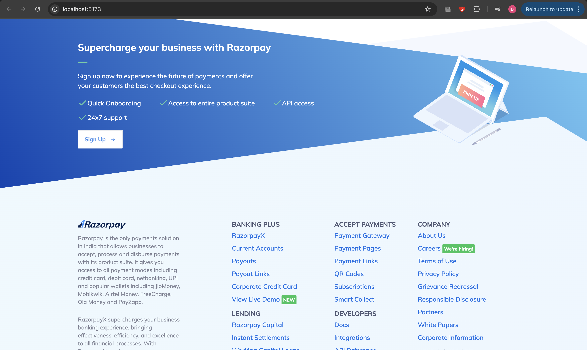

# 💳 Razorpay Clone

A fully responsive **Razorpay landing page clone** built using **Tailwind CSS**. This clone replicates the sleek, modern UI of Razorpay with a mobile-friendly design and clean layout.

---

## 📸 Screenshots

| Home Section | Features Section |
|--------------|------------------|
|  |  |

| Integrations | Testimonials | Footer |
|--------------|--------------|--------|
|  |  |  |


---

## 🚀 Features

- ✅ Pixel-perfect Razorpay UI clone
- 📱 Responsive design across all devices
- ⚡ Built using utility-first Tailwind CSS
- 🌐 Clean layout with clear call-to-actions
- 🎯 Organized, scalable HTML structure

---

## 🛠️ Tech Stack

- **HTML5**
- **Tailwind CSS**
- **JavaScript** for minor interactivity

---

## 📁 Project Structure

---

razorpay-clone/ ├── index.html ├── tailwind.config.js ├── postcss.config.js ├── input.css (optional) ├── output.css (generated) ├── screenshots/ │ ├── screenshot1.png │ ├── screenshot2.png │ ├── screenshot3.png │ ├── screenshot4.png │ └── screenshot5.png └── README.md

---

## ⚙️ Getting Started

1. **Clone the Repository**
```bash
git clone https://github.com/Krishrajput1107/razorpay-clone.git
cd razorpay-clone
Install Tailwind CSS (if using via CLI)

Copy
Edit
npm install -D tailwindcss
npx tailwindcss init
Start Tailwind Build Process

Copy
Edit
npx tailwindcss -i ./input.css -o ./output.css --watch
Open index.html in Browser

Use VS Code’s Live Server or just open manually.

```

## 📌 To Do
 Add animations using AOS/Framer Motion

 Add dark mode support

 Make Navbar sticky

 Deploy on Netlify or Vercel

## 🙋‍♂️ Author
Made with ❤️ by Krish Rajput

🌐 Portfolio

🐙 GitHub

💼 LinkedIn


